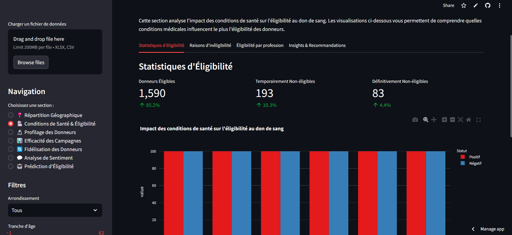

# Team : MKDIR WINNERS

# Tableau de Bord de la Campagne de Don de Sang
# Le projet a été déployé à l'aide de streamlit
[cliquer ici pour visiter](https://indabax.streamlit.app/) ||
[l'api est disponible ici : ](https://indabax-api-model.onrender.com/docs) ||
[reamdme pour le code d'api](https://github.com/Nameless0l/blood_donation_dashboard_indabax/tree/main/api)
## Introduction

Ce tableau de bord interactif a été développé pour aider les organisateurs de campagnes de don de sang à visualiser, analyser et prédire les données relatives aux donneurs. Il permet d'optimiser les futures campagnes en fournissant des insights précieux sur la répartition géographique des donneurs, l'impact des conditions de santé sur l'éligibilité, et les caractéristiques des donneurs idéaux.

Développé dans le cadre du concours IndabaX 2025, ce tableau de bord est entièrement implémenté en Python et utilise des techniques avancées de visualisation de données et d'apprentissage automatique.


## Fonctionnalités

Le tableau de bord offre les fonctionnalités suivantes :

### 📍 Cartographie de la Répartition des Donneurs
- Visualisation de la répartition géographique par arrondissement et quartier
- Carte interactive des localisations des donneurs
- Analyse des zones à forte et faible participation

### 🏥 Conditions de Santé & Éligibilité
- Analyse de l'impact des conditions médicales sur l'éligibilité
- Visualisation des corrélations entre différentes conditions de santé
- Statistiques sur les taux d'éligibilité par condition médicale

### 🔬 Profilage des Donneurs Idéaux
- Clustering des donneurs basé sur des caractéristiques démographiques et médicales
- Identification des profils de donneurs les plus susceptibles d'être éligibles
- Visualisation des caractéristiques clés des donneurs idéaux

### 📊 Analyse de l'Efficacité des Campagnes
- Analyse temporelle des dons (mensuelle, annuelle)
- Identification des périodes optimales pour les campagnes
- Analyse des groupes démographiques les plus contributeurs

### 🔄 Fidélisation des Donneurs
- Analyse des facteurs influençant le retour des donneurs
- Visualisation des taux de fidélisation par caractéristique démographique
- Recommandations pour améliorer la fidélisation

### 💬 Analyse de Sentiment
- Analyse des retours textuels des donneurs (si disponibles)
- Visualisation des tendances d'opinion

### 🤖 Prédiction d'Éligibilité
- Modèle de prédiction de l'éligibilité des donneurs
- Interface intuitive pour tester le modèle
- Explication des facteurs influençant la prédiction

## Prérequis

- Python 3.8+
- Pip ou Conda pour l'installation des dépendances

## Installation

1. Clonez ce dépôt :
```bash
git clone https://github.com/Nameless0l/blood_donation_dashboard_indabax.git 
cd blood_donation_dashboard_indabax
```

2. Créez un environnement virtuel (recommandé) :
```bash
python -m venv venv
source venv/bin/activate  # Sur Windows : venv\Scripts\activate
```

3. Installez les dépendances :
```bash
pip install -r requirements.txt
```

## Structure du Projet

```
tableau-bord-don-sang/
├── app.py                   # Application Streamlit principale
├──          # Scripts de prétraitement des données
├── model/                   # fonctions
│   ├── visualizations.py        # Fonctions de visualisation
│   └── preprocessing.py         # Scripts de prétraitement des données
├── model/                   # Modèles entraînés
│   └── eligibility_model_gradient_boosting_20250323_104955.pkl
├── data/processed_data/          # Données prétraitées
│   └── *.csv
├── data/                    # Données brutes
│   └── dataset.xlsx
├── images/                  # Images pour la documentation
├── api/                  # api()
├── notebooks/               # Notebooks Jupyter pour l'exploration et le modèle
│   └── eligibility_model_training.ipynb
├── requirements.txt         # Dépendances du projet
└── README.md                # Documentation du projet
```

## Utilisation

1. Lancez l'application Streamlit :
```bash
streamlit run app.py
```

2. Accédez à l'application dans votre navigateur (par défaut : http://localhost:8501)

3. Explorez les différentes sections du tableau de bord à l'aide du menu de navigation dans la barre latérale

## Description des Sections

### Navigation et Filtrage

Le tableau de bord dispose d'une barre latérale permettant de :
- Naviguer entre les différentes sections
- Filtrer les données par arrondissement, tranche d'âge et sexe
- Uploader vos propres données (formats Excel ou CSV)

Chaque filtre appliqué met à jour automatiquement toutes les visualisations du tableau de bord.

### Répartition Géographique

Cette section présente des visualisations de la distribution géographique des donneurs :
- Graphique à barres des arrondissements les plus représentés
- Graphique horizontal des quartiers les plus représentés
- Carte interactive des donneurs (si les coordonnées sont disponibles)

### Conditions de Santé & Éligibilité

Cette section analyse l'impact des conditions médicales sur l'éligibilité au don de sang :
- Visualisation de l'impact de chaque condition sur le taux d'éligibilité
- Matrice de corrélation entre les différentes conditions
- Répartition des raisons d'inéligibilité temporaire et définitive

### Profilage des Donneurs

Cette section identifie les caractéristiques communes des donneurs idéaux :
- Graphiques de répartition de l'éligibilité par caractéristique démographique
- Visualisation des clusters de donneurs
- Graphiques radar des profils de donneurs idéaux

### Efficacité des Campagnes

Cette section analyse les tendances temporelles des dons :
- Graphique d'évolution mensuelle des dons
- Analyse des périodes optimales de l'année
- Répartition des dons par jour de la semaine
- Analyse des groupes démographiques les plus contributeurs

### Fidélisation des Donneurs

Cette section explore les facteurs influençant le retour des donneurs :
- Proportion de donneurs récurrents vs nouveaux donneurs
- Taux de fidélisation par caractéristique démographique
- Analyse du temps écoulé entre les dons

### Prédiction d'Éligibilité

Cette section permet de prédire l'éligibilité d'un donneur potentiel :
- Formulaire de saisie des caractéristiques du donneur
- Prédiction de l'éligibilité avec niveau de confiance
- Explication des facteurs influençant la prédiction
- Règles de sécurité strictes pour les critères d'exclusion absolus

## Modèle de Prédiction d'Éligibilité

### Description du Modèle

Le tableau de bord utilise un modèle de Gradient Boosting pour prédire l'éligibilité des donneurs au don de sang. Ce modèle a été sélectionné après une évaluation comparative de trois algorithmes différents (Random Forest, Gradient Boosting et XGBoost).

Le modèle utilise les caractéristiques suivantes pour la prédiction :
- Caractéristiques démographiques (âge, genre, niveau d'étude, etc.)
- Historique de don (expérience de don antérieure)
- Caractéristiques géographiques (arrondissement, quartier)
- Informations médicales (taux d'hémoglobine)

### Règles de Sécurité

En plus des prédictions du modèle, le système applique des règles de sécurité strictes pour garantir que certaines conditions médicales (comme être porteur du VIH ou de l'hépatite B/C) entraînent automatiquement une inéligibilité, indépendamment des autres caractéristiques.

Ces règles incluent :
- Porteur de VIH, hépatite B ou C → Toujours non éligible
- Drépanocytaire → Toujours non éligible
- Problèmes cardiaques → Toujours non éligible
- Taux d'hémoglobine insuffisant → Toujours non éligible

### Performance du Modèle

- Accuracy : 89.03%
- Precision : 91.62%
- Recall : 95.63%
- F1 Score : 93.58%
- ROC AUC : 88.16%

### API de Prédiction

Le modèle peut être intégré à d'autres applications via une API REST. 

documentation
```bash
https://indabax-api-model.onrender.com/docs
```
Exemple d'utilisation :
```python
import requests
import json

url = "https://indabax-api-model.onrender.com/predict_eligibility"
data = {
  "age": 70,
  "genre": "Homme",
  "niveau_etude": "Non précisé",
  "situation_matrimoniale": "Non précisé",
  "profession": "Non précisé",
  "nationalite": "Camerounaise",
  "religion": "Non précisé",
  "deja_donne": "Oui",
  "arrondissement": "Douala (Non précisé)",
  "quartier": "Non précisé",
  "porteur_vih_hbs_hcv": false,
  "diabetique": false,
  "hypertendu": false,
  "asthmatique": false,
  "drepanocytaire": false,
  "cardiaque": false,
  "taux_hemoglobine": 20,
  "transfusion": false,
  "tatoue": false,
  "scarifie": false
}

response = requests.post(url, json=data)
result = json.loads(response.text)
print(f"Prédiction: {result['prediction']}, Confiance: {result['confidence']}%")
```

## Dépannage

### Problèmes connus

1. **Erreur de chargement du modèle**
   - Vérifiez que le fichier du modèle existe dans le dossier `api/model/`
   - Vérifiez les permissions sur ce fichier

2. **Erreur lors de la prédiction d'éligibilité**
   - Les noms de caractéristiques doivent correspondre exactement à ceux utilisés lors de l'entraînement
   - Vérifiez que toutes les caractéristiques requises sont présentes

3. **Problèmes d'affichage de la carte**
   - Vérifiez votre connexion internet (la carte utilise des tuiles en ligne)
   - Assurez-vous que les données géographiques sont correctement formatées

### Contact

Pour toute question ou problème, veuillez créer une issue sur GitHub ou contacter l'équipe de développement.

## Licence

Ce projet est sous licence MIT. Voir le fichier LICENSE pour plus de détails.

---

Développé pour IndabaX 2025 par Mbassi Loic and Komguem Isis.