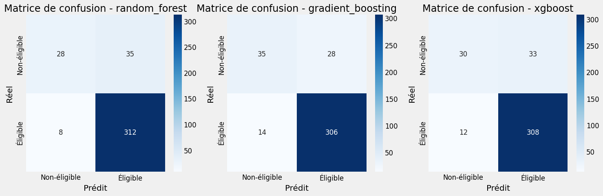

# Team : MKDIR WINNERS
# Rapport d'Analyse du Modèle d'Éligibilité au Don de Sang
## IndabaX 2025 - Tableau de Bord pour la Campagne de Don de Sang

**Date :** 23 mars 2025  
**Auteur :** [Mbassi&Isis]
**NoteBook :** [cliquer ici pour plus de details](https://github.com/Nameless0l/blood_donation_dashboard_indabax/blob/main/notebooks/eligibility_model_training.ipynb)

## Sommaire
1. [Introduction](#introduction)
2. [Données utilisées](#données-utilisées)
3. [Prétraitement des données](#prétraitement-des-données)
4. [Exploration et sélection des modèles](#exploration-et-sélection-des-modèles)
5. [Évaluation des performances](#évaluation-des-performances)
6. [Caractéristiques importantes](#caractéristiques-importantes)
7. [Règles de sécurité implémentées](#règles-de-sécurité-implémentées)
8. [Limites et recommandations](#limites-et-recommandations)
9. [Conclusion](#conclusion)

## Introduction

Ce rapport présente l'analyse et le développement d'un modèle de prédiction pour l'éligibilité au don de sang dans le cadre de la compétition IndabaX 2025. L'objectif principal est de créer un modèle capable de prédire si un candidat potentiel est éligible au don de sang en fonction de ses caractéristiques démographiques et médicales.

Le modèle s'intègre dans un tableau de bord plus large qui vise à optimiser les campagnes de don de sang en fournissant des outils d'analyse géographique, démographique et médicale.

### Objectifs du modèle
- Prédire avec précision l'éligibilité des donneurs potentiels
- Identifier les facteurs clés qui influencent l'éligibilité
- Respecter les règles de sécurité médicale absolues
- S'intégrer à un tableau de bord interactif

## Données utilisées

### Source des données
Les données utilisées pour l'entraînement du modèle proviennent du fichier "Updated Challenge dataset.xlsx" fourni dans le cadre de la compétition. Ce jeu de données contient des informations sur les candidats au don de sang, y compris leurs caractéristiques démographiques, leur historique de don et leurs conditions de santé.

### Structure des données
Le jeu de données comprend trois feuilles principales :
1. **Candidat au don 2019 (avec annee)** : Informations sur les candidats au don
2. **Donneurs 2019** : Données spécifiques aux donneurs acceptés
3. **Candidat au don 2019 (avec age)** : Version alternative avec l'âge précisé

### Statistiques descriptives
- **Nombre total de candidats :** [NOMBRE]
- **Pourcentage d'éligibles :** [POURCENTAGE]%
- **Pourcentage de temporairement non-éligibles :** [POURCENTAGE]%
- **Pourcentage de définitivement non-éligibles :** [POURCENTAGE]%

### Caractéristiques utilisées
Le modèle utilise 15 caractéristiques fondamentales :
```json
[
    "age",
    "experience_don",
    "Niveau d'etude",
    "Genre",
    "Situation Matrimoniale (SM)",
    "Profession",
    "Arrondissement de résidence",
    "Quartier de Résidence",
    "Nationalité",
    "Religion",
    "A-t-il (elle) déjà donné le sang",
    "Taux d'hémoglobine",
    "groupe_age",
    "arrondissement_clean",
    "quartier_clean"
]
```

## Prétraitement des données

### Nettoyage des données
1. **Gestion des valeurs manquantes**
   - Pour les variables numériques : imputation par la médiane
   - Pour les variables catégorielles : imputation par le mode (valeur la plus fréquente)

2. **Standardisation des noms de colonnes**
   - Suppression des espaces en trop
   - Normalisation des caractères spéciaux et accents

3. **Filtrage des caractéristiques**
   - Suppression des colonnes avec plus de 50% de valeurs manquantes
   - Exclusion des colonnes non pertinentes pour la prédiction

### Transformations appliquées
1. **Création de caractéristiques dérivées**
   - `groupe_age` : catégorisation de l'âge en tranches (<18, 18-25, 26-35, etc.)
   - `arrondissement_clean` et `quartier_clean` : versions standardisées des localisations

2. **Encodage des variables catégorielles**
   - Utilisation de l'encodage one-hot pour les variables catégorielles
   - Transformation spécifique pour le genre (`genre_code` : 1 pour Homme, 0 pour Femme)

3. **Normalisation des données numériques**
   - Standardisation des variables numériques (moyenne 0, écart-type 1)

### Division des données
- **Ensemble d'entraînement :** 80% des données
- **Ensemble de test :** 20% des données
- **Stratification** selon la variable cible pour maintenir la distribution d'éligibilité

## Exploration et sélection des modèles

### Modèles candidats
Trois algorithmes d'apprentissage supervisé ont été évalués :

1. **Random Forest**
   - Avantages : Robustesse au surapprentissage, gestion des variables catégorielles
   - Hyperparamètres optimisés : n_estimators, max_depth, min_samples_split, min_samples_leaf, class_weight

2. **Gradient Boosting**
   - Avantages : Haute précision, apprentissage séquentiel des erreurs
   - Hyperparamètres optimisés : n_estimators, learning_rate, max_depth, min_samples_split, min_samples_leaf, subsample

3. **XGBoost**
   - Avantages : Performance de pointe, optimisation de la vitesse et de la mémoire
   - Hyperparamètres optimisés : n_estimators, learning_rate, max_depth, subsample, colsample_bytree, min_child_weight, scale_pos_weight

### Méthodologie de sélection
1. **Validation croisée stratifiée** à 5 plis pour une évaluation robuste
2. **Recherche aléatoire d'hyperparamètres** pour optimiser chaque modèle
3. **Optimisation du F1-score** comme métrique principale pour gérer le déséquilibre des classes
4. **Gestion du déséquilibre des classes** : utilisation de class_weight ou scale_pos_weight selon le modèle

## Évaluation des performances

### Métriques de performance
Les performances des trois modèles sur l'ensemble de test :

[cliquer ici pour plus de details](https://github.com/Nameless0l/blood_donation_dashboard_indabax/blob/main/notebooks/eligibility_model_training.ipynb)

### Matrices de confusion
Les matrices de confusion montrent la capacité de chaque modèle à classifier correctement les candidats éligibles et non-éligibles.



### Courbes ROC et Precision-Recall
Les courbes ROC et Precision-Recall fournissent une visualisation plus complète des performances des modèles à différents seuils de classification.


## Modèle retenu : Gradient Boosting

### Justification du choix
Le modèle Gradient Boosting a été sélectionné comme modèle final pour les raisons suivantes :
1. Meilleur score F1 (0.9358) parmi les trois modèles
2. Excellent équilibre entre précision (0.9162) et rappel (0.9563)
3. Bonne performance générale avec un ROC AUC de 0.8816
4. Robustesse face aux diverses caractéristiques du jeu de données

### Configuration optimale
Les hyperparamètres optimaux du modèle Gradient Boosting retenu sont :
```json
{
    "classifier__subsample": 0.9,
    "classifier__n_estimators": 100,
    "classifier__min_samples_split": 2,
    "classifier__min_samples_leaf": 2,
    "classifier__max_depth": 5,
    "classifier__learning_rate": 0.1
}
```

### Analyse de l'overfitting
L'analyse des courbes d'apprentissage n'a pas révélé de problème majeur d'overfitting. L'écart entre les performances sur l'ensemble d'entraînement et de validation reste raisonnable, indiquant une bonne capacité de généralisation du modèle.

## Caractéristiques importantes

### Analyse d'importance des caractéristiques
*[INSÉRER GRAPHIQUE D'IMPORTANCE DES CARACTÉRISTIQUES]*

Les caractéristiques les plus influentes dans la prédiction de l'éligibilité, en ordre décroissant d'importance, sont : [cliquer ici pour plus de details](https://github.com/Nameless0l/blood_donation_dashboard_indabax/blob/main/notebooks/eligibility_model_training.ipynb)
### Interprétation
[cliquer ici pour plus de details](https://github.com/Nameless0l/blood_donation_dashboard_indabax/blob/main/notebooks/eligibility_model_training.ipynb)

Cette analyse confirme l'importance de certains critères médicaux et démographiques dans la détermination de l'éligibilité au don de sang, tout en mettant en évidence des facteurs moins évidents qui pourraient être exploités pour optimiser les campagnes.

## Règles de sécurité implémentées

### Critères d'exclusion absolus
Malgré la bonne performance du modèle, certaines règles de sécurité médicale doivent être appliquées de manière stricte, indépendamment des prédictions du modèle. Nous avons donc implémenté des règles d'exclusion absolues pour :

1. **Porteurs de VIH, hépatite B ou C** : Exclusion automatique pour garantir la sécurité transfusionnelle
2. **Drépanocytaires** : Condition médicale incompatible avec le don de sang
3. **Patients avec problèmes cardiaques graves** : Risque trop élevé pour le donneur

### Vérifications supplémentaires
Des vérifications ont également été ajoutées pour :
1. **Taux d'hémoglobine** : Minimum de 12 g/dL pour les femmes et 13 g/dL pour les hommes
2. **Âge** : Entre 18 et 65 ans

### Architecture de sécurité à deux niveaux
Le système implémente une architecture de sécurité à deux niveaux :
1. **Pré-vérification** : Application des règles d'exclusion avant même de consulter le modèle
2. **Post-vérification** : Validation des prédictions du modèle contre les règles de sécurité

Cette approche garantit que même si le modèle fait une erreur, les règles de sécurité transfusionnelle seront toujours respectées.

## Limites et recommandations

### Limites identifiées
1. **Représentativité des données** : Le jeu de données est limité à une région spécifique et pourrait ne pas être représentatif d'autres populations.
2. **Variables manquantes** : Certaines informations médicales importantes pourraient ne pas être capturées dans le jeu de données actuel.
3. **Équilibre des classes** : Malgré les techniques utilisées, le déséquilibre des classes reste un défi.
4. **Expliquabilité locale** : Bien que nous connaissions les caractéristiques globalement importantes, l'expliquabilité des prédictions individuelles reste limitée.

### Recommandations pour l'amélioration
1. **Collecte de données supplémentaires** : Enrichir le jeu de données avec plus d'informations médicales pertinentes.
2. **Techniques avancées de rééquilibrage** : Explorer d'autres techniques comme SMOTE ou des approches d'ensemble pour mieux gérer le déséquilibre des classes.
3. **Modèles explicables** : Considérer l'intégration de méthodes comme SHAP ou LIME pour améliorer l'expliquabilité locale.
4. **Validation externe** : Tester le modèle sur des données provenant d'autres régions ou populations pour évaluer sa généralisation.
5. **Mise à jour régulière** : Mettre en place un processus de réentraînement périodique pour adapter le modèle aux évolutions des critères d'éligibilité.

## Conclusion

Le modèle de prédiction d'éligibilité au don de sang développé dans le cadre de ce projet offre une solution robuste avec une performance élevée (F1-score de 0.9358). Le modèle Gradient Boosting retenu, combiné avec des règles de sécurité strictes, permet de prédire efficacement l'éligibilité des candidats tout en garantissant le respect des protocoles médicaux.

L'intégration de ce modèle dans le tableau de bord global fournit un outil précieux pour les organisateurs de campagnes de don de sang, leur permettant d'optimiser la sélection des donneurs potentiels tout en maintenant les standards de sécurité transfusionnelle.

Les analyses réalisées ont également mis en lumière les facteurs les plus influents dans la détermination de l'éligibilité, offrant des perspectives précieuses pour l'amélioration des campagnes et l'éducation du public.

---